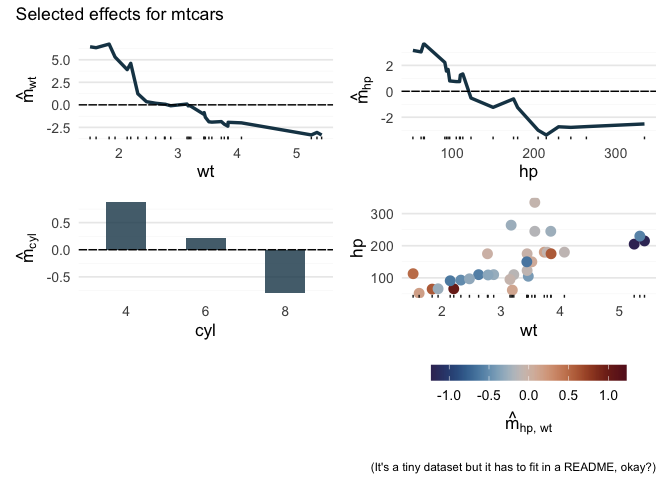

<!-- README.md is generated from README.Rmd. Please edit that file -->

# randomPlantedForest

<!-- badges: start -->

[](https://github.com/PlantedML/randomPlantedForest/actions/workflows/R-CMD-check.yaml)
[](https://app.codecov.io/gh/PlantedML/randomPlantedForest?branch=master)
[](https://plantedml.r-universe.dev/randomPlantedForest)
<!-- badges: end -->

`randomPlantedForest` implements “Random Planted Forest”, a directly
interpretable tree ensemble [(arxiv)](https://arxiv.org/abs/2012.14563).

## Installation

You can install the development version of `randomPlantedForest` from
[GitHub](https://github.com/) with

``` r
# install.packages("remotes")
remotes::install_github("PlantedML/randomPlantedForest")
```

or from [r-universe](https://plantedml.r-universe.dev/packages) with

``` r
install.packages("randomPlantedForest", repos = "https://plantedml.r-universe.dev")
```

## Example

Model fitting uses a familiar interface:

``` r
library(randomPlantedForest)

mtcars$cyl <- factor(mtcars$cyl)
rpfit <- rpf(mpg ~ cyl + wt + hp, data = mtcars, ntrees = 25, max_interaction = 2)
rpfit
#> -- Regression Random Planted Forest --
#> 
#> Formula: mpg ~ cyl + wt + hp 
#> Fit using 3 predictors and 2-degree interactions.
#> Forest is _not_ purified!
#> 
#> Called with parameters:
#> 
#>             loss: L2
#>           ntrees: 25
#>  max_interaction: 2
#>           splits: 30
#>        split_try: 10
#>            t_try: 0.4
#>            delta: 0
#>          epsilon: 0.1
#>    deterministic: FALSE
#>         nthreads: 1
#>           purify: FALSE
#>               cv: FALSE

predict(rpfit, new_data = mtcars) |>
  cbind(mpg = mtcars$mpg) |>
  head()
#>      .pred  mpg
#> 1 20.81459 21.0
#> 2 20.72354 21.0
#> 3 26.04526 22.8
#> 4 21.26845 21.4
#> 5 18.45921 18.7
#> 6 19.54406 18.1
```

Prediction components can be accessed via `predict_components`,
including the intercept, main effects, and interactions up to a
specified degree. The returned object also contains the original data as
`x`, which is required for visualization. The `glex` package can be used
as well: `glex(rpfit)` yields the same result.

``` r
components <- predict_components(rpfit, new_data = mtcars) 

str(components)
#> List of 3
#>  $ m        :Classes 'data.table' and 'data.frame':  32 obs. of  6 variables:
#>   ..$ cyl   : num [1:32] 0.445 0.445 0.863 0.445 -1.274 ...
#>   ..$ wt    : num [1:32] -0.0615 -0.1421 2.3182 -0.0155 -0.3116 ...
#>   ..$ hp    : num [1:32] 0.162 0.162 2.021 0.162 -0.941 ...
#>   ..$ cyl:wt: num [1:32] 0.00389 0.00389 0.69586 0.17156 0.4615 ...
#>   ..$ cyl:hp: num [1:32] 0.1453 0.1453 -0.0511 0.1453 0.1179 ...
#>   ..$ hp:wt : num [1:32] -0.1264 -0.1367 -0.0487 0.1138 0.1596 ...
#>   ..- attr(*, ".internal.selfref")=<externalptr> 
#>  $ intercept: num 20.2
#>  $ x        :Classes 'data.table' and 'data.frame':  32 obs. of  3 variables:
#>   ..$ cyl: Factor w/ 3 levels "4","6","8": 2 2 1 2 3 2 3 1 1 2 ...
#>   ..$ wt : num [1:32] 2.62 2.88 2.32 3.21 3.44 ...
#>   ..$ hp : num [1:32] 110 110 93 110 175 105 245 62 95 123 ...
#>   ..- attr(*, ".internal.selfref")=<externalptr> 
#>  - attr(*, "class")= chr [1:3] "glex" "rpf_components" "list"
```

Various visualization options are available via `glex`, e.g. for main
and second-order interaction effects:

``` r
# install glex if not available:
if (!requireNamespace("glex")) remotes::install_github("PlantedML/glex")
#> Loading required namespace: glex
library(glex)
library(ggplot2)
library(patchwork) # For plot arrangement

p1 <- autoplot(components, "wt")
p2 <- autoplot(components, "hp")
p3 <- autoplot(components, "cyl")
p4 <- autoplot(components, c("wt", "hp"))

(p1 + p2) / (p3 + p4) +
  plot_annotation(
    title = "Selected effects for mtcars",
    caption = "(It's a tiny dataset but it has to fit in a README, okay?)"
  )
```



See the [Bikesharing
decomposition](https://plantedml.com/glex/articles/Bikesharing-Decomposition-rpf.html)
article for more examples.
