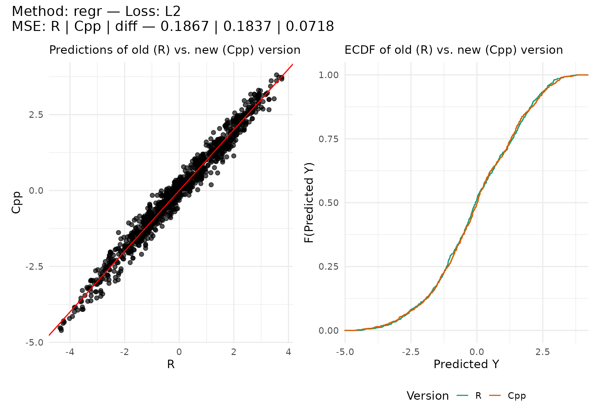
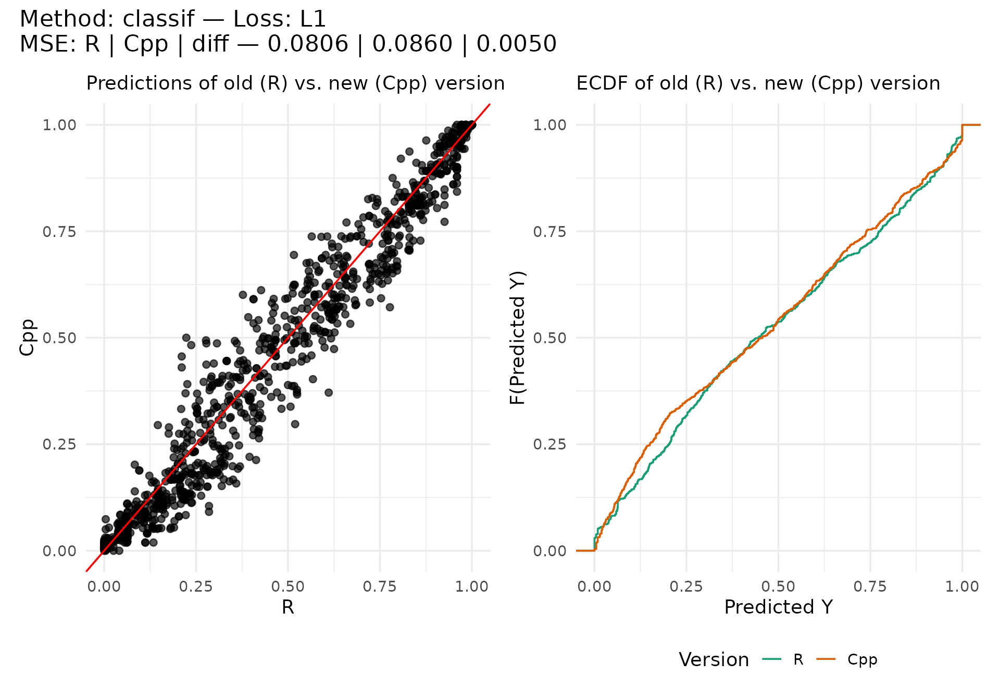
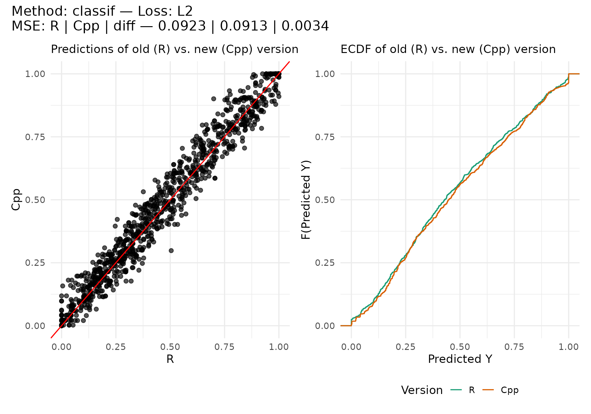
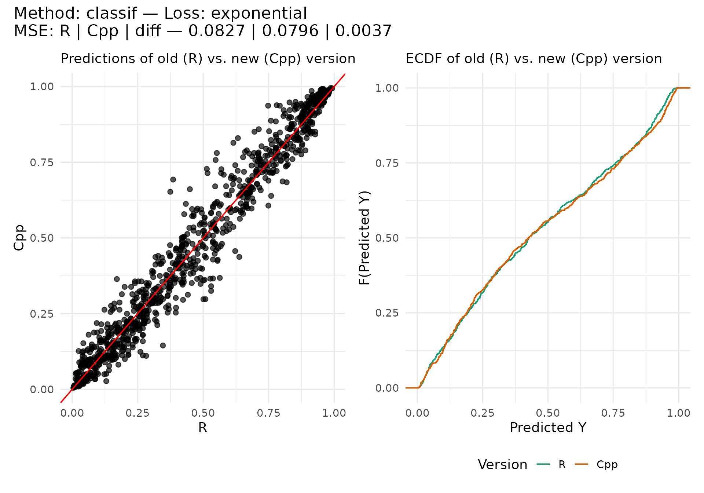
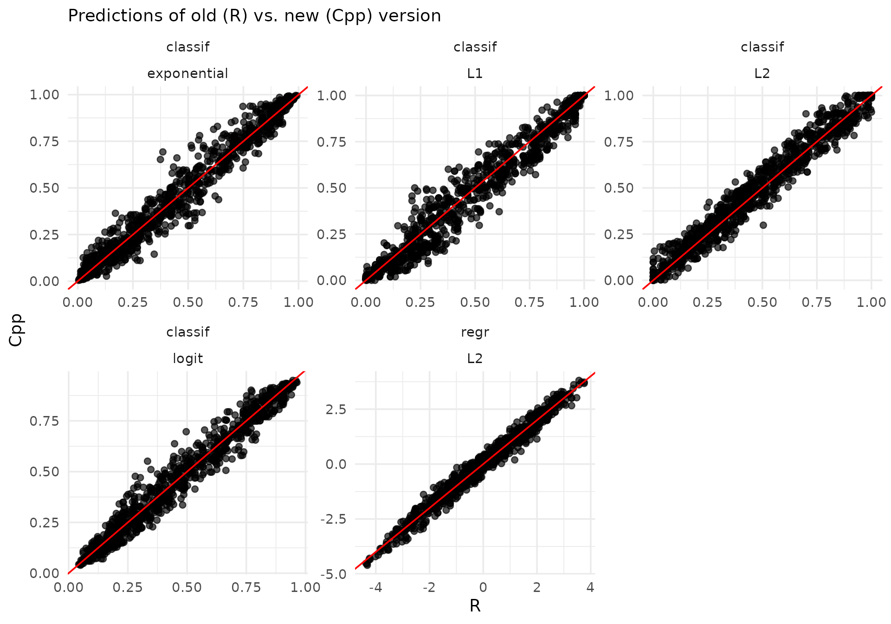
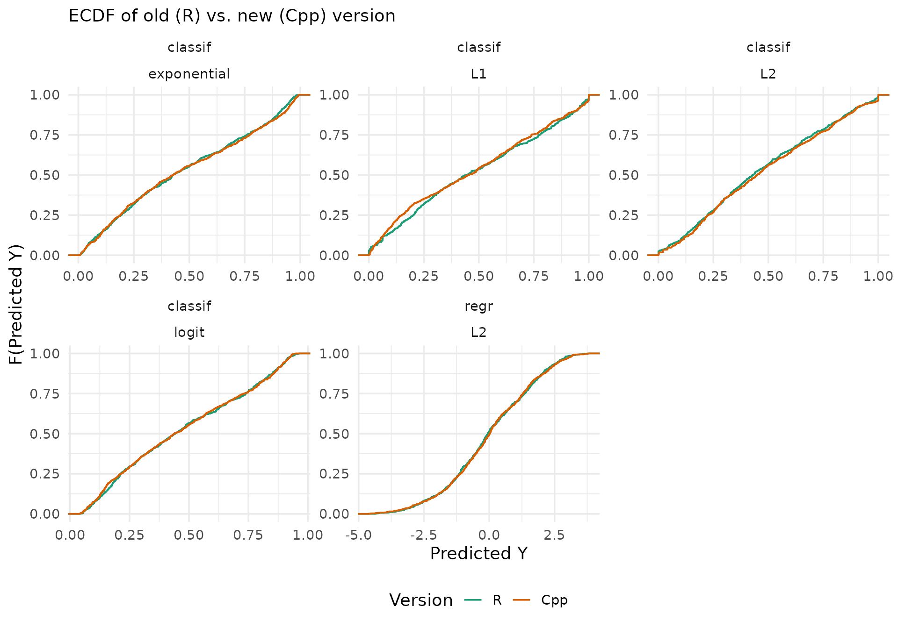

# Regression Test: oldrpf

This article serves as a regression test to check the behavior of the
current (C++) implementation against the previous “old” implementation,
referred to as `oldrpf`.

## Regression

Only supports `loss = "L2"` and parameters `epsilon` and `delta` are not
applicable.

| method | loss |      R |     Cpp |    diff |
|:-------|:-----|-------:|--------:|--------:|
| regr   | L2   | 0.1867 | 0.18369 | 0.07184 |

## Classification

### L1 Loss

| method  | loss |       R |     Cpp |    diff |
|:--------|:-----|--------:|--------:|--------:|
| classif | L1   | 0.08063 | 0.08598 | 0.00502 |

### L2 Loss

| method  | loss |       R |     Cpp |    diff |
|:--------|:-----|--------:|--------:|--------:|
| classif | L2   | 0.09227 | 0.09132 | 0.00336 |

### Logit Loss

| method  | loss  |       R |     Cpp |    diff |
|:--------|:------|--------:|--------:|--------:|
| classif | logit | 0.08893 | 0.09096 | 0.00257 |

### Exponential Loss

| method  | loss        |       R |     Cpp |    diff |
|:--------|:------------|--------:|--------:|--------:|
| classif | exponential | 0.08266 | 0.07963 | 0.00375 |

## Summary Comparison

| method  | loss        |       R |     Cpp |    diff |
|:--------|:------------|--------:|--------:|--------:|
| regr    | L2          | 0.18670 | 0.18369 | 0.07184 |
| classif | L1          | 0.08063 | 0.08598 | 0.00502 |
| classif | L2          | 0.09227 | 0.09132 | 0.00336 |
| classif | logit       | 0.08893 | 0.09096 | 0.00257 |
| classif | exponential | 0.08266 | 0.07963 | 0.00375 |

