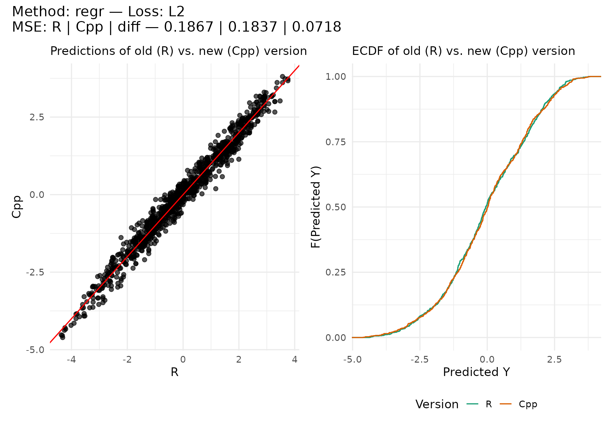
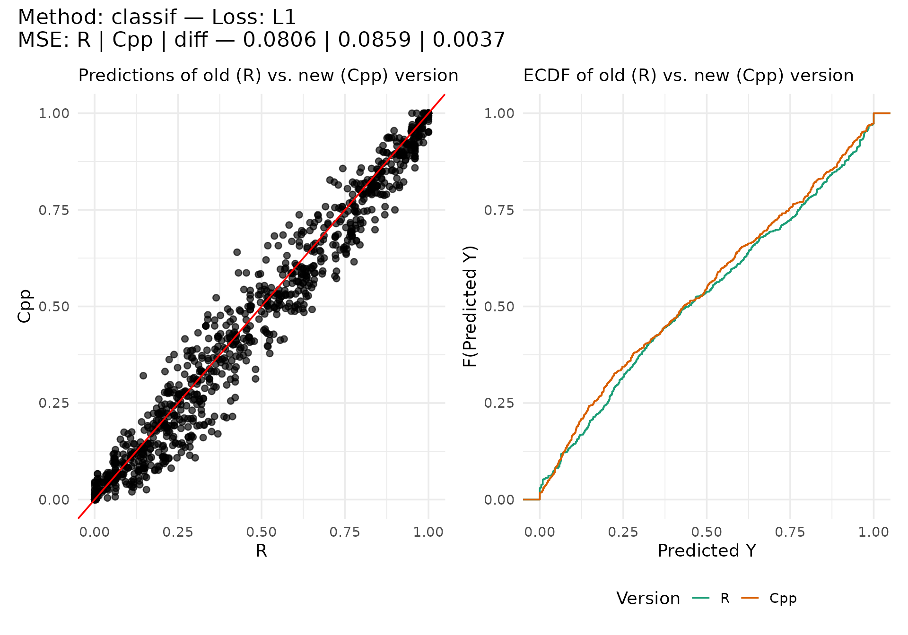
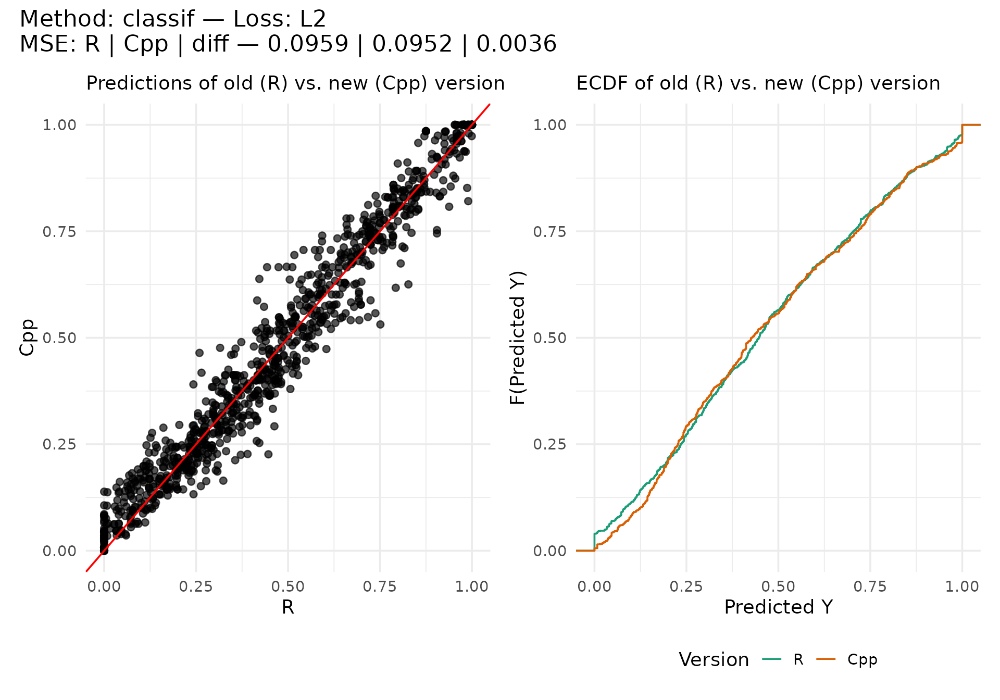
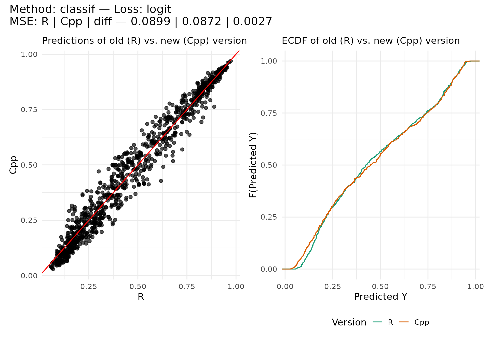
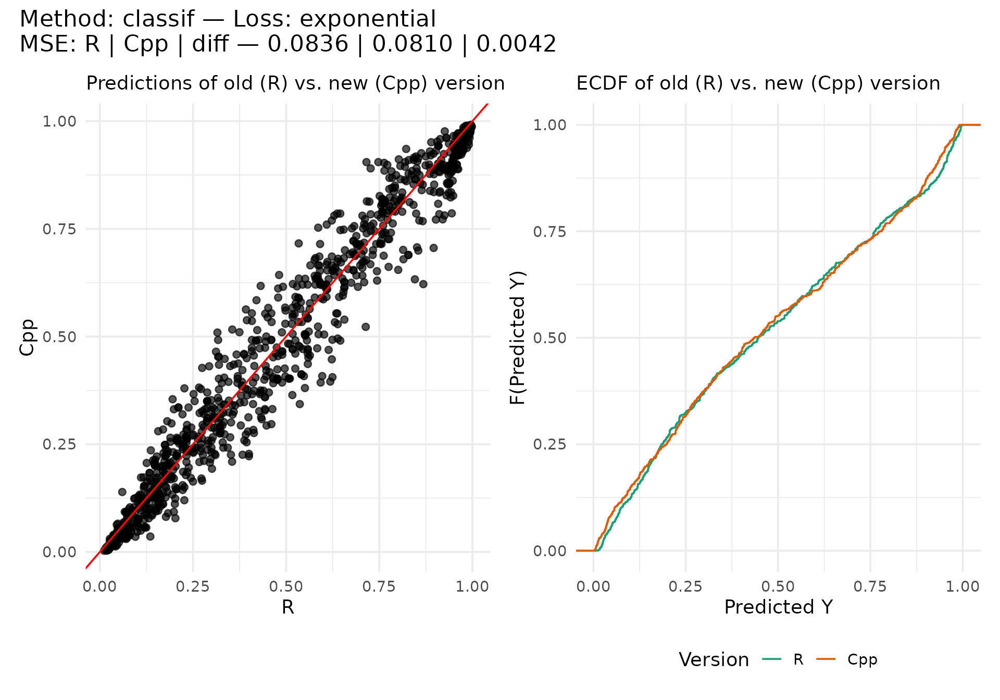
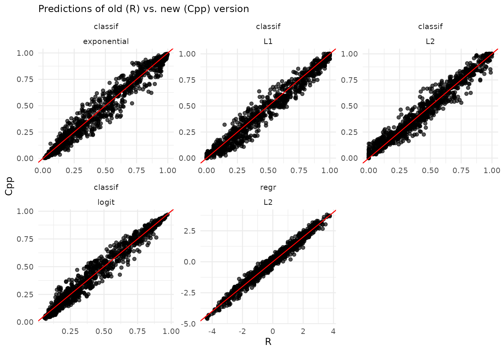
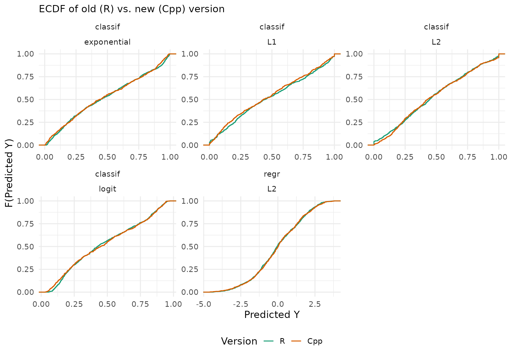

# Regression Test: oldrpf

This article serves as a regression test to check the behavior of the
current (C++) implementation against the previous “old” implementation,
referred to as `oldrpf`.

## Regression

Only supports `loss = "L2"` and parameters `epsilon` and `delta` are not
applicable.

| method | loss |      R |     Cpp |    diff |
|:-------|:-----|-------:|--------:|--------:|
| regr   | L2   | 0.1867 | 0.18369 | 0.07184 |

## Classification

### L1 Loss

| method  | loss |       R |     Cpp |    diff |
|:--------|:-----|--------:|--------:|--------:|
| classif | L1   | 0.08063 | 0.08591 | 0.00369 |

### L2 Loss

| method  | loss |      R |    Cpp |    diff |
|:--------|:-----|-------:|-------:|--------:|
| classif | L2   | 0.0959 | 0.0952 | 0.00357 |

### Logit Loss

| method  | loss  |       R |     Cpp |    diff |
|:--------|:------|--------:|--------:|--------:|
| classif | logit | 0.08992 | 0.08721 | 0.00265 |

### Exponential Loss

| method  | loss        |      R |     Cpp |    diff |
|:--------|:------------|-------:|--------:|--------:|
| classif | exponential | 0.0836 | 0.08097 | 0.00419 |

## Summary Comparison

| method  | loss        |       R |     Cpp |    diff |
|:--------|:------------|--------:|--------:|--------:|
| regr    | L2          | 0.18670 | 0.18369 | 0.07184 |
| classif | L1          | 0.08063 | 0.08591 | 0.00369 |
| classif | L2          | 0.09590 | 0.09520 | 0.00357 |
| classif | logit       | 0.08992 | 0.08721 | 0.00265 |
| classif | exponential | 0.08360 | 0.08097 | 0.00419 |

