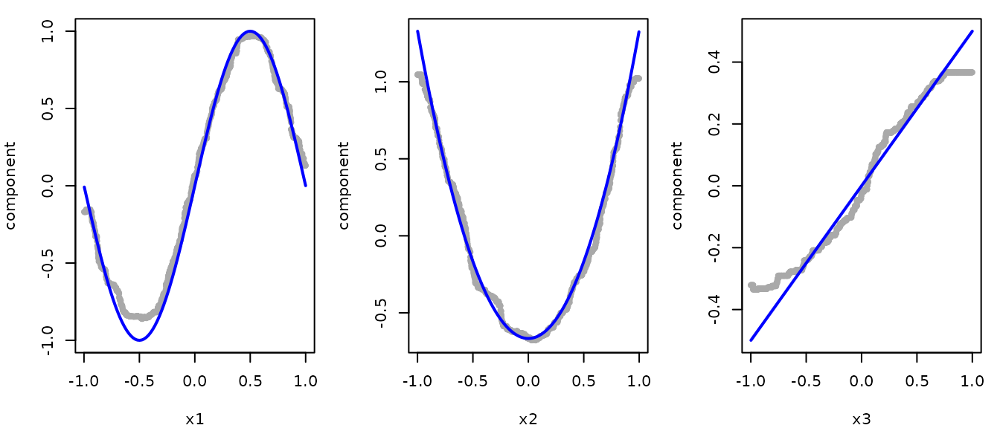
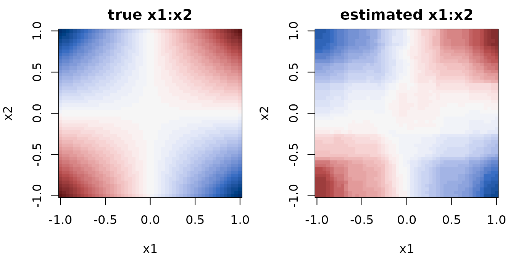

# Getting Started with randomPlantedForest

`randomPlantedForest` implements Random Planted Forest ([Hiabu, Mammen &
Meyer](https://arxiv.org/abs/2012.14563)), a directly interpretable tree
ensemble. Its defining feature is that the maximum order of interaction
between predictors can be bounded via `max_interaction`: the fitted
model then decomposes exactly into main effects, two-way interactions,
and so on, a functional ANOVA decomposition, with no post-hoc
approximation needed.

``` r

library(randomPlantedForest)
```

## Fitting a regression forest

To see what the model recovers, we simulate data where the true
components are known. The outcome depends on `x1`, `x2` and `x3` through
main effects of different shapes and on `x1` and `x2` jointly through a
product interaction with `x4` having no effect at all:

``` math
y = 1 + \sin(\pi x_1) + 2\left(x_2^2 - \tfrac{1}{3}\right) + \tfrac{x_3}{2} + 2 x_1 x_2 + \varepsilon
```

With uniform predictors on $`[-1, 1]`$, each term has mean zero and the
interaction has no main-effect part, so the terms are exactly the
components the model is meant to estimate.

``` r

set.seed(1)
n <- 1000
sim <- data.frame(
  x1 = runif(n, -1, 1),
  x2 = runif(n, -1, 1),
  x3 = runif(n, -1, 1),
  x4 = runif(n, -1, 1)
)
true_effects <- list(
  x1 = function(x) sin(pi * x),
  x2 = function(x) 2 * (x^2 - 1 / 3),
  x3 = function(x) x / 2
)
sim$y <- 1 +
  true_effects$x1(sim$x1) +
  true_effects$x2(sim$x2) +
  true_effects$x3(sim$x3) +
  2 * sim$x1 * sim$x2 +
  rnorm(n, sd = 0.3)
```

``` r

rpfit <- rpf(y ~ ., data = sim, max_interaction = 2, ntrees = 50)
rpfit
#> ── Regression Random Planted Forest ────────────────────────────────────────────
#> Formula: `y ~ .`
#> 50 tree families with 30 splits each on 4 predictors, interactions to degree 2.
#> ℹ Forest is not purified.
#> 
#> ── Tree growing 
#>    split_structure: leaves
#>          split_try: 10
#>              t_try: 0.4
#>     max_candidates: 50
#>   split_decay_rate: 0.1
#>      delete_leaves: TRUE
#> 
#> ℹ Fit using 1 thread, also the default for `predict()` and `purify()`.
```

`max_interaction = 2` restricts the forest to main effects and two-way
interactions. This is the central tuning choice of the method: lower
values give a more interpretable, more constrained model, while
`max_interaction = 0` allows interactions of any order. `ntrees` sets
the number of tree families in the ensemble.

Prediction works as usual:

``` r

predict(rpfit, new_data = head(sim))
#> # A tibble: 6 × 1
#>     .pred
#>     <dbl>
#> 1 -0.217 
#> 2  0.0562
#> 3  1.27  
#> 4  3.83  
#> 5  1.17  
#> 6  0.955
```

Note that
[`rpf()`](https://plantedml.com/randomPlantedForest/dev/reference/rpf.md)
does not handle missing values: rows containing `NA` must be imputed or
removed beforehand (see the `recipes` section below for one way to do
this as part of the model specification).

## Decomposing predictions

Because the interaction order is bounded, the prediction function is a
sum of low-dimensional components:

``` math
\hat{m}(x) = \hat{m}_0 + \sum_k \hat{m}_k(x_k) + \sum_{k < l} \hat{m}_{kl}(x_k, x_l)
```

[`predict_components()`](https://plantedml.com/randomPlantedForest/dev/reference/predict_components.md)
returns exactly this decomposition: an intercept and one column per main
effect and interaction term, evaluated on the supplied data. The forest
is *purified* internally to make the decomposition unique, which is why
the print method above reports the purification state.

``` r

components <- predict_components(rpfit, new_data = sim)

components$intercept
#> [1] 0.9862177
names(components$m)
#>  [1] "x1"    "x2"    "x3"    "x4"    "x1:x2" "x1:x3" "x1:x4" "x2:x3" "x2:x4"
#> [10] "x3:x4"
```

The components sum exactly to the model prediction:

``` r

pred_sum <- components$intercept + rowSums(components$m)
pred_direct <- predict(rpfit, new_data = sim)$.pred

all.equal(pred_sum, pred_direct)
#> [1] TRUE
```

Each column of `components$m` is the isolated contribution of one
predictor (or one pair) to the prediction, on the scale of the outcome.
Their standard deviations give a simple importance measure: the three
main effects and the `x1:x2` interaction dominate, while `x4` and the
other interactions are close to zero, as they should be.

``` r

round(sort(sapply(components$m, sd), decreasing = TRUE), 3)
#> x1:x2    x1    x2    x3 x2:x3 x1:x3    x4 x1:x4 x2:x4 x3:x4 
#> 0.656 0.655 0.573 0.258 0.026 0.007 0.000 0.000 0.000 0.000
```

The estimated main effects follow the true functions (blue lines). As
with any tree-based model, they flatten out towards the edges of the
data, where few observations are available to determine them.

``` r

op <- par(mfrow = c(1, 3), mar = c(4, 4, 1, 1))
for (v in names(true_effects)) {
  ylim <- range(components$m[[v]], true_effects[[v]](sim[[v]]))
  plot(
    sim[[v]],
    components$m[[v]],
    pch = 20,
    col = "darkgray",
    ylim = ylim,
    xlab = v,
    ylab = "component"
  )
  curve(true_effects[[v]](x), add = TRUE, lwd = 2, col = "blue")
}
```



``` r

par(op)
```

The interaction is a function of two variables, so it is shown as a
heatmap. We evaluate the estimated `x1:x2` component on a grid. Note
`x3` and `x4` must be present in the new data but do not affect this
component.

``` r

grid_points <- seq(-1, 1, length.out = 50)
grid <- expand.grid(x1 = grid_points, x2 = grid_points, x3 = 0, x4 = 0)
estimated <- predict_components(rpfit, new_data = grid, predictors = c("x1", "x2"))$m[["x1:x2"]]

surfaces <- list(
  true = outer(grid_points, grid_points, function(x1, x2) 2 * x1 * x2),
  estimated = matrix(estimated, nrow = length(grid_points))
)
zlim <- c(-1, 1) * max(abs(unlist(surfaces)))

op <- par(mfrow = c(1, 2), mar = c(4, 4, 2, 1))
for (s in names(surfaces)) {
  image(
    grid_points,
    grid_points,
    surfaces[[s]],
    zlim = zlim,
    col = hcl.colors(51, "Blue-Red 3"),
    xlab = "x1",
    ylab = "x2",
    main = paste(s, "x1:x2")
  )
}
```



``` r

par(op)
```

The plots above are drawn manually from
[`predict_components()`](https://plantedml.com/randomPlantedForest/dev/reference/predict_components.md)
for illustration. The [`glex`](https://plantedml.com/glex/) package
provides `ggplot2` versions of them: `glex()` computes the decomposition
for a fitted `rpf` object, and `plot_main_effect()` and
`plot_twoway_effects()` draw main effects and two-way interactions.

## Classification

For a factor outcome,
[`rpf()`](https://plantedml.com/randomPlantedForest/dev/reference/rpf.md)
automatically fits a classification forest. We illustrate with the
`penguins` data from `palmerpenguins`, removing missing values first.

### Binary

``` r

penguins <- na.omit(palmerpenguins::penguins)

rpfit_sex <- rpf(sex ~ ., data = penguins, ntrees = 50)

predict(rpfit_sex, head(penguins), type = "prob")
#> # A tibble: 6 × 2
#>   .pred_female .pred_male
#>          <dbl>      <dbl>
#> 1       0.0591    0.941  
#> 2       0.806     0.194  
#> 3       0.995     0.00546
#> 4       0.998     0.00219
#> 5       0.0243    0.976  
#> 6       0.992     0.00801
predict(rpfit_sex, head(penguins), type = "class")
#> # A tibble: 6 × 1
#>   .pred_class
#>   <fct>      
#> 1 male       
#> 2 female     
#> 3 female     
#> 4 female     
#> 5 male       
#> 6 female
```

With the default `loss = "exponential"` (or `"logit"`), `type = "link"`
additionally gives raw predictions on the log-odds scale.

### Multiclass

Multiclass classification works the same way: probability predictions
contain one column per class:

``` r

rpfit_species <- rpf(species ~ ., data = penguins, ntrees = 50)

predict(rpfit_species, head(penguins), type = "prob")
#> # A tibble: 6 × 3
#>   .pred_Adelie .pred_Chinstrap .pred_Gentoo
#>          <dbl>           <dbl>        <dbl>
#> 1        1.000   0.00000000457     1.35e-11
#> 2        1.000   0.0000000237      5.63e-11
#> 3        1.000   0.0000000217      3.63e-11
#> 4        1.000   0.00000000188     7.16e-12
#> 5        1.000   0.00000000200     8.66e-12
#> 6        1.000   0.0000000225      4.10e-11
predict(rpfit_species, head(penguins), type = "class")
#> # A tibble: 6 × 1
#>   .pred_class
#>   <fct>      
#> 1 Adelie     
#> 2 Adelie     
#> 3 Adelie     
#> 4 Adelie     
#> 5 Adelie     
#> 6 Adelie
```

The default loss for classification is `"exponential"`, which gives
proper probability estimates. `"logit"` gives similar results but is
slower, while `"L1"` and `"L2"` fit class indicators directly and do not
yield proper probabilities. Note that with `loss = "logit"`, multiclass
models are fit on a reference-class (log-odds) scale, so link
predictions and components have one column less than there are classes:
see
[`?predict.rpf`](https://plantedml.com/randomPlantedForest/dev/reference/predict.rpf.md)
for details.

## Using `recipes`

[`rpf()`](https://plantedml.com/randomPlantedForest/dev/reference/rpf.md)
also accepts a [`recipes`](https://recipes.tidymodels.org/) recipe in
place of a formula, so preprocessing can be bundled with the model
specification. This makes it easy to add preprocessing steps, such as
imputing missing values, which
[`rpf()`](https://plantedml.com/randomPlantedForest/dev/reference/rpf.md)
itself does not accept:

``` r

library(recipes)

# rows with a missing outcome still need to be dropped by hand
peng_raw <- subset(palmerpenguins::penguins, !is.na(body_mass_g))

rec <- recipe(body_mass_g ~ ., data = peng_raw) |>
  step_impute_median(all_numeric_predictors()) |>
  step_impute_mode(all_nominal_predictors())

rpfit_rec <- rpf(rec, data = peng_raw, ntrees = 50)

predict(rpfit_rec, head(peng_raw))
#> # A tibble: 6 × 1
#>   .pred
#>   <dbl>
#> 1 3801.
#> 2 3491.
#> 3 3572.
#> 4 3482.
#> 5 4006.
#> 6 3422.
```

The preprocessing steps are stored with the model and applied
automatically in [`predict()`](https://rdrr.io/r/stats/predict.html).

## Saving and restoring models

An `rpf` object holds its forest in an external pointer to a C++ object,
which [`saveRDS()`](https://rdrr.io/r/base/readRDS.html) cannot
preserve, meaning that a naively saved and restored model is not usable:

``` r

tmp <- tempfile(fileext = ".rds")
saveRDS(rpfit, tmp)
broken <- readRDS(tmp)

rpf_is_valid(broken)
#> [1] FALSE
predict(broken, head(sim))
#> Error in `predict()`:
#> ! The C++ forest behind this <rpf> object is gone.
#> ℹ Most likely it was saved with `saveRDS()` and restored with `readRDS()`.
#> ℹ Use `blob <- rpf_marshal(x)` before saving and `rpf_unmarshal(blob)` after
#>   loading, see `?rpf_marshal()`.
```

Use
[`rpf_marshal()`](https://plantedml.com/randomPlantedForest/dev/reference/rpf_marshal.md)
to convert the model into a plain R list before saving, and
[`rpf_unmarshal()`](https://plantedml.com/randomPlantedForest/dev/reference/rpf_marshal.md)
after loading:

``` r

saveRDS(rpf_marshal(rpfit), tmp)
restored <- rpf_unmarshal(readRDS(tmp))

all.equal(
  predict(restored, head(sim)),
  predict(rpfit, head(sim))
)
#> [1] TRUE
```

Alternatively, a [`bundle`](https://rstudio.github.io/bundle/) method
wrapping the same mechanism is available via
[`bundle::bundle()`](https://rstudio.github.io/bundle/reference/bundle.html)
and
[`bundle::unbundle()`](https://rstudio.github.io/bundle/reference/bundle.html).
