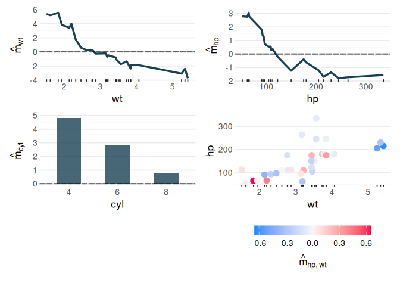

# randomPlantedForest

`randomPlantedForest` implements Random Planted Forest ([Hiabu, Mammen &
Meyer](https://arxiv.org/abs/2012.14563)), a tree ensemble whose
predictions you can read off directly, without post-hoc explanation
methods.

Like a random forest, it averages many tree-based models grown on
bootstrap samples. Unlike a random forest, each of these models is a sum
of trees that each split on a fixed set of predictors, and
`max_interaction` bounds how many predictors that can be. With
`max_interaction = 1` the forest is an additive model; with `2` it adds
pairwise interactions, and so on. As a result, the fitted model
decomposes exactly into an intercept, main effects and interactions up
to that order:

``` math
\hat m(x) = \hat m_0 + \sum_k \hat m_k(x_k) + \sum_{k < l} \hat m_{kl}(x_k, x_l) + \dots
```

Each component can be inspected and plotted on its own, and together
they sum to the prediction.

## Installation

Install the development version from
[r-universe](https://plantedml.r-universe.dev/packages) with

``` r

install.packages("randomPlantedForest", repos = "https://plantedml.r-universe.dev")
```

or from [GitHub](https://github.com/PlantedML/randomPlantedForest) with

``` r

# install.packages("pak")
pak::pak("PlantedML/randomPlantedForest")
```

## Example

[`rpf()`](https://plantedml.com/randomPlantedForest/reference/rpf.md)
takes a formula, x/y data or a
[recipe](https://recipes.tidymodels.org/), and
[`predict()`](https://rdrr.io/r/stats/predict.html) returns a tibble as
in tidymodels:

``` r

library(randomPlantedForest)

mtcars$cyl <- factor(mtcars$cyl)
rpfit <- rpf(mpg ~ cyl + wt + hp, data = mtcars, ntrees = 25, max_interaction = 2)
rpfit
#> ── Regression Random Planted Forest ───────────────────────────────────────────────────────────────────────────────────────────────────────────────────────────────────────────────────────────────────────────────────────────
#> Formula: `mpg ~ cyl + wt + hp`
#> 25 tree families with 30 splits each on 3 predictors, interactions to degree 2.
#> ℹ Forest is not purified.
#> 
#> ── Tree growing 
#>    split_structure: leaves
#>          split_try: 10
#>              t_try: 0.4
#>     max_candidates: 50
#>   split_decay_rate: 0.1
#>      delete_leaves: TRUE
#> 
#> ℹ Fit using 1 thread, also the default for `predict()` and `purify()`.

head(predict(rpfit, new_data = mtcars))
#> # A tibble: 6 × 1
#>   .pred
#>   <dbl>
#> 1  21.4
#> 2  21.0
#> 3  24.4
#> 4  20.9
#> 5  17.7
#> 6  19.1
```

[`predict_components()`](https://plantedml.com/randomPlantedForest/reference/predict_components.md)
returns the decomposition: one column per main effect and interaction,
plus the intercept.

``` r

components <- predict_components(rpfit, new_data = mtcars)
head(components$m)
#>          cyl         wt         hp     cyl:wt      cyl:hp        hp:wt
#>        <num>      <num>      <num>      <num>       <num>        <num>
#> 1: 2.8275105  0.2569457  0.2970626  0.3448129  0.06873138  0.006002504
#> 2: 2.8275105 -0.2438784  0.2970626  0.3929089  0.06873138  0.076817727
#> 3: 4.8022694  1.7754646  1.3572422 -0.4610986 -0.41379471 -0.231709254
#> 4: 2.8275105 -0.4727413  0.2970626  0.3538112  0.06873138  0.256989969
#> 5: 0.7661282 -1.0143147 -0.3952336  0.4528133  0.02336632  0.241715900
#> 6: 2.8275105 -1.1525180  0.5397470 -0.4590129 -0.03247695 -0.199217461
```

The [glex](https://plantedml.com/glex/) package plots these components:

``` r

library(glex)
library(ggplot2)
library(patchwork)

(autoplot(components, "wt") + autoplot(components, "hp")) /
  (autoplot(components, "cyl") + autoplot(components, c("wt", "hp")))
```



The [Get
started](https://plantedml.com/randomPlantedForest/articles/randomPlantedForest.html)
guide covers classification, recipes, saving models and more on
interpreting components, and the [Bikesharing
decomposition](https://plantedml.com/glex/articles/Bikesharing-Decomposition-rpf.html)
article works through a larger example.
